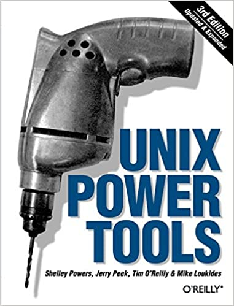

<!-- backgroundImage: url(background-cable.jpg)-->
# Vim PowerFull Editor for dummies

---

# Vim

<!-- backgroundImage: url()-->


Vim est considéré comme un des "Unix Power Tools".
Sa courbe d'apprentissage nécessite un effort au début mais le retour d'investissement en vaut la chandelle: un administrateur Linux qui ne connaît pas Vim n'est pas un administrateur POINT !

---

# Vim a plusieurs modes

* Quand vous ouvrez un fichier vous serez en mode **normal**.
* Afin de passer en mode **insertion** il suffit de taper *i* et *ESC* pour revenir au mode **normal**. On peut aussi taper *o* afin de commencer à saisir sur une nouvelle ligne.
* Le mode **commande** est obtenu depuis le mode **normal** en tapant *:*
* Le mode **visuel** et ses trois sous-modes (**caractère**, **ligne**, **bloc**) est très utile afin de manipuler des blocs de texte.

---

# Tips & Tricks Vim

* Afficher les numéros des lignes, allez à une ligne
* Enregistrer
* Undo
* Cherchez, remplacer
* Historiques des commandes (q:ou q? en mode normal )
* ggVGy => Copier toutes les lignes
* De l'aide (:help oud help command )

---

# Tips & Tricks Vim (1)

* Se déplacer (mode normal):
   hjkl (noremap dans .vimrc) ou flèches
   w ==> Se déplacer au début des mots
   e ==> Se déplacer à la fin de mots
   b ==> Marche arrière sur le début des mots
   0 ==> (zero) aller en début de ligne
   $ ==> (dollar) aller en fin de ligne
   gg ==> début du document
   G ==> fin du document
   SHIFT J ==> Rassembler deux lignes

---

# Tips & Tricks Vim (2)

* Indenter,copier-coller avec Visual Mode
=> mode Visual Character et > (avance) ou <(retrait)
=> mode Visual Block et I/D

* g CTRL G => compter les mots
* Ouvrir des fenêtres  Vertical Split :vs  et :sp
* Enregistrer une macro a (qa/@a)

---

# Tips & Tricks Vim (3): Configuration

* Choisir son éditeur par défaut

```bash
sudo update-alternatives --config editor
# Ou
export SYSTEMD_EDITOR=vim
```

* Comment enregistrer (y compris sans être root un fichier lui appartenant=> :w !sudo tee %

* .vimrc afin de paramétrer (plugins)

---

# Tips & Tricks Vim (4)

* %norm A, => Ajouter en fin de ligne une virgule
* SPACE SPACE W => plugin easy motion

---

# Vim EasterEggs

(cherchez !)

                               oooo$$$$$$$$$$$$oooo
                          oo$$$$$$$$$$$$$$$$$$$$$$$$o
                       oo$$$$$$$$$$$$$$$$$$$$$$$$$$$$$$o         o$   $$ o$
     o $ oo          o$$$$$$$$$$$$$$$$$$$$$$$$$$$$$$$$$$$$o       $$ $$ $$o$
    oo $ $ "$      o$$$$$$$$$    $$$$$$$$$$$$$    $$$$$$$$$o       $$$o$$o$
    "$$$$$$o$     o$$$$$$$$$      $$$$$$$$$$$      $$$$$$$$$$o    $$$$$$$$
      $$$$$$$    $$$$$$$$$$$      $$$$$$$$$$$      $$$$$$$$$$$$$$$$$$$$$$$
      $$$$$$$$$$$$$$$$$$$$$$$    $$$$$$$$$$$$$    $$$$$$$$$$$$$$  """$$$
       "$$$""""$$$$$$$$$$$$$$$$$$$$$$$$$$$$$$$$$$$$$$$$$$$$$$$$$     "$$$
        $$$   o$$$$$$$$$$$$$$$$$$$$$$$$$$$$$$$$$$$$$$$$$$$$$$$$$$     "$$$o
       o$$"   $$$$$$$$$$$$$$$$$$$$$$$$$$$$$$$$$$$$$$$$$$$$$$$$$$$       $$$o
       $$$    $$$$$$$$$$$$$$$$$$$$$$$$$$$$$$$$$$$$$$$$$$$$$" "$$$$$$ooooo$$$$o
      o$$$oooo$$$$$  $$$$$$$$$$$$$$$$$$$$$$$$$$$$$$$$$$$$$   o$$$$$$$$$$$$$$$$$
      $$$$$$$$"$$$$   $$$$$$$$$$$$$$$$$$$$$$$$$$$$$$$$$$     $$$$""""""""
     """"       $$$$    "$$$$$$$$$$$$$$$$$$$$$$$$$$$$"      o$$$
                "$$$o     """$$$$$$$$$$$$$$$$$$"$$"         $$$
                  $$$o          "$$""$$$$$$""""           o$$$
                   $$$$o                                o$$$"
                    "$$$$o      o$$$$$$o"$$$$o        o$$$$
                      "$$$$$oo     ""$$$$o$$$$$o   o$$$$""
                         ""$$$$$oooo  "$$$o$$$$$$$$$"""
                            ""$$$$$$$oo $$$$$$$$$$
                                    """"$$$$$$$$$$$
                                        $$$$$$$$$$$$
                                         $$$$$$$$$$"
                                          "$$$""""
